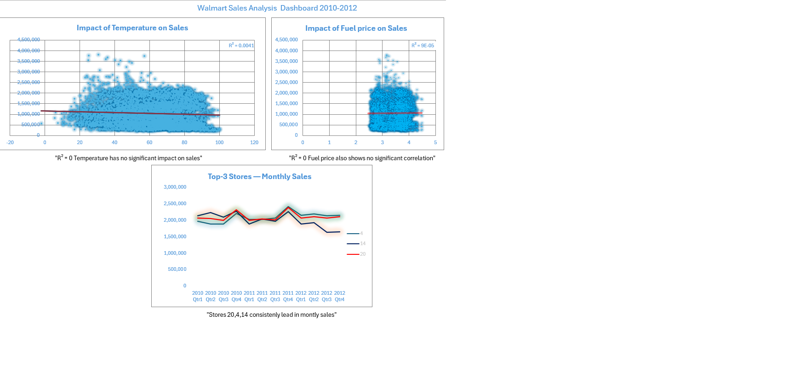

# Walmart Sales Analysis — Data Analytics Portfolio Project  

📊 **Tools used:** Excel (Pivot Tables, Charts, Dashboards)  
📅 **Period:** 2010–2012  
📂 **Level:** Intermediate  

---

## 🔹 Dashboard Preview

---

## 🔹 Key Insights
- **Temperature vs Sales** → R² ≈ 0 → no significant correlation.  
- **Fuel Price vs Sales** → R² ≈ 0 → fuel price has no measurable impact on sales.  
- **Top-3 Stores (20, 4, 14)** → consistently lead in total sales volume.  

---

## 🔹 Files in this repository
- `Intermediate/Walmart_Sales_Intermediate.xlsx` → Excel file with the dashboard  
- `Intermediate/dashboard_intermediate.png` → dashboard screenshot  

---

## 🔹 Next Steps
- Add **Basic Dashboard** (Top-10 stores, Holiday vs Normal Weeks).  
- Build **Advanced Dashboard** with forecasting (Moving Average).  
